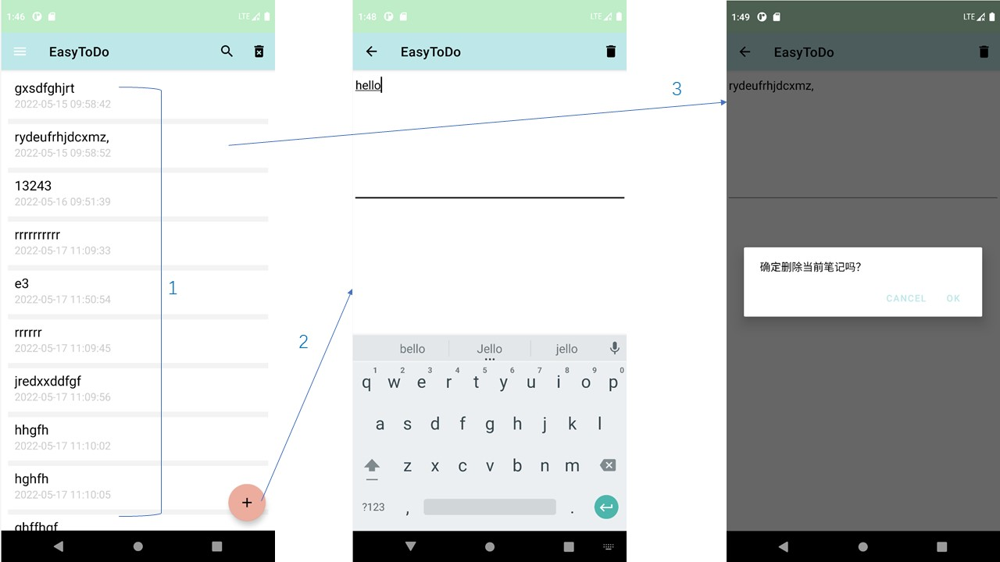
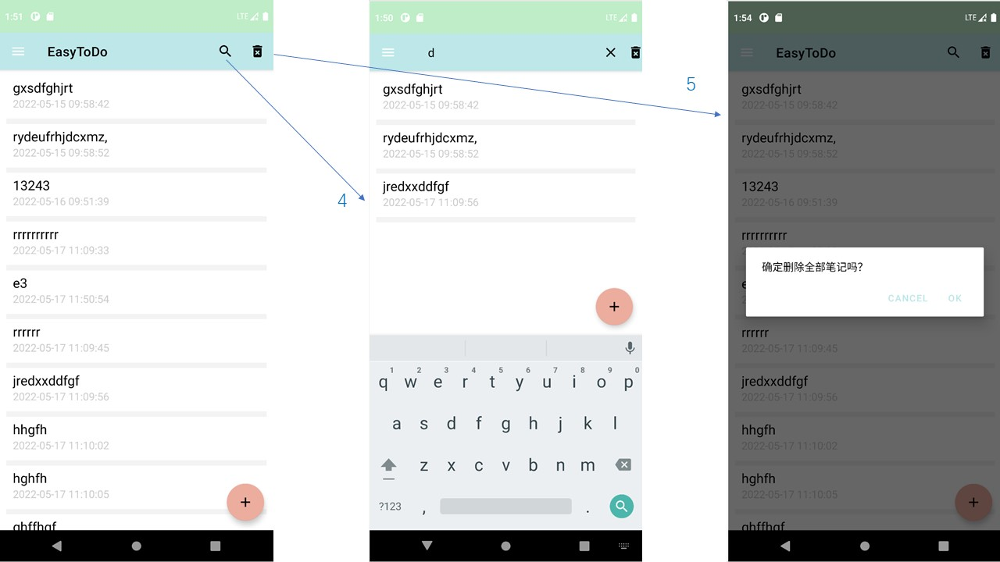
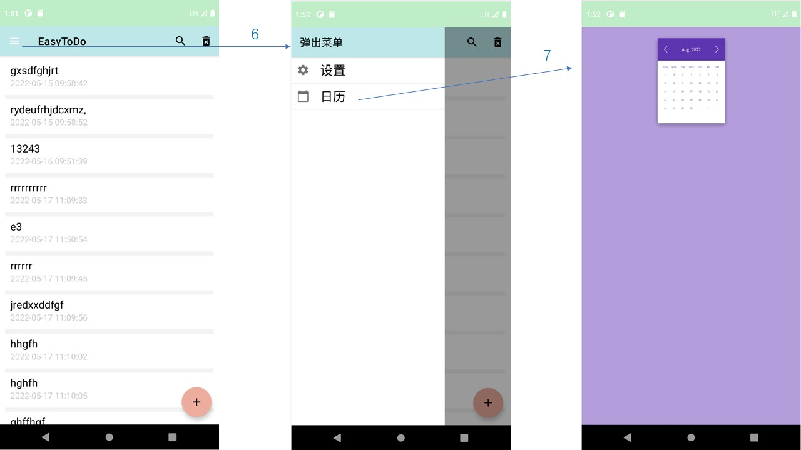
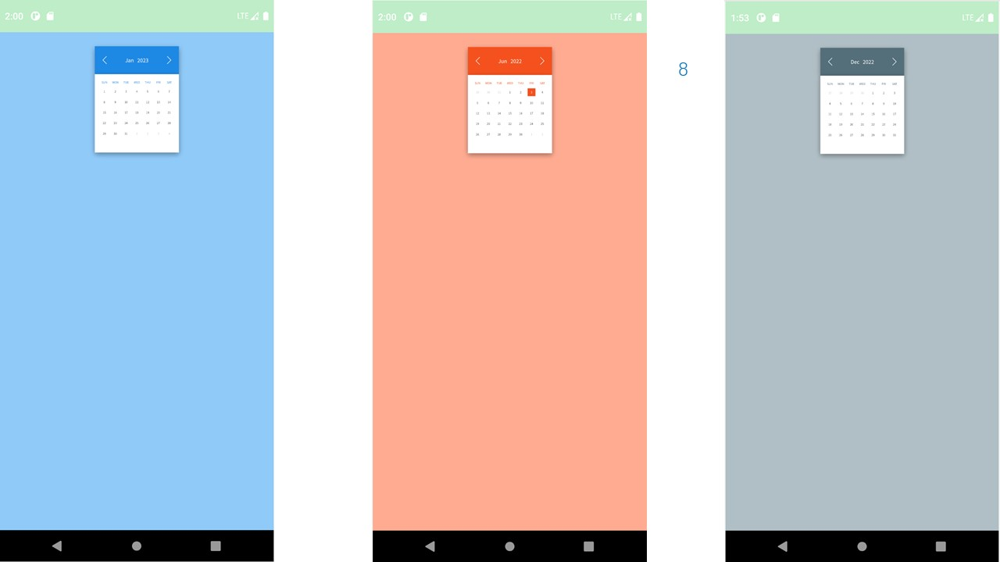
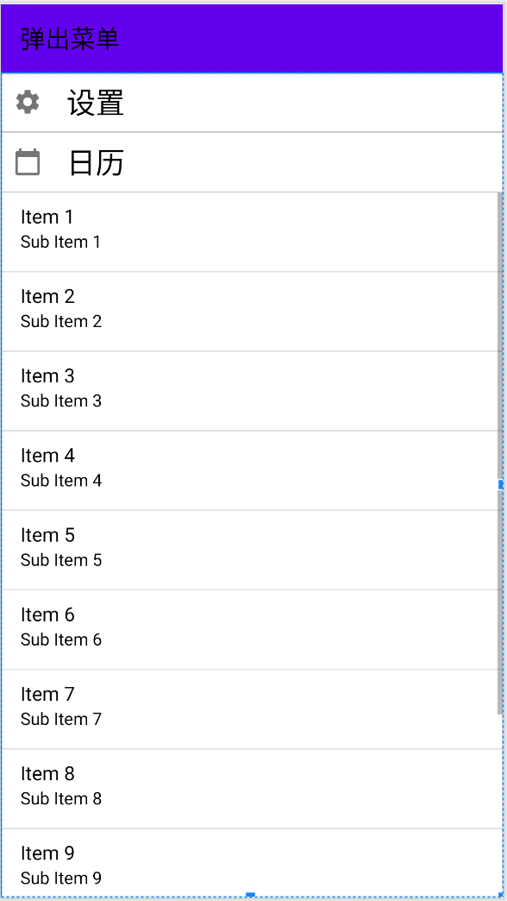
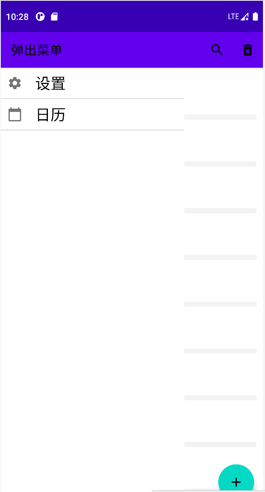
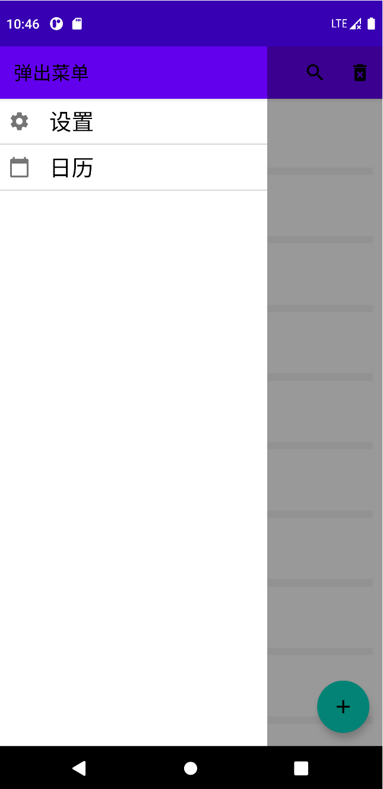
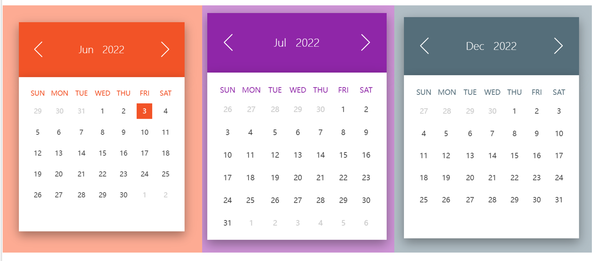
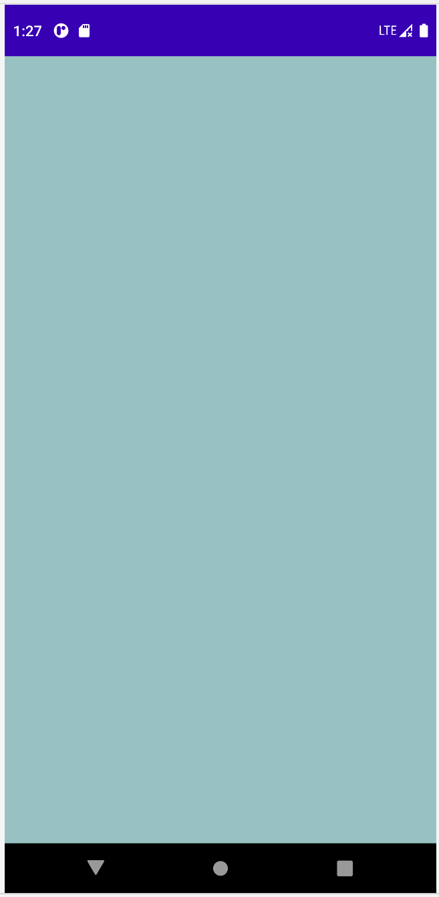
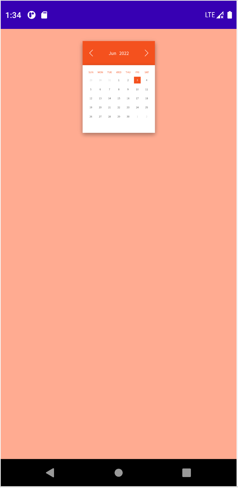

# **EasyToDo记事本**

## 一、数据库

这个记事本主要的功能就是对于笔记的内容进行增删改查，对数据库的数据进行操作，数据库使用的是SQLite。

SQLite可以满足APP在本地使用时存储数据的要求，然后通过下面的步骤就可以将每个客户端的数据同步到服务器的数据库中

1. 
   对客户端和本地数据表notes表(使用id作为数据唯一表示)映射，实现增删改。

2. 每次将对本地数据表的操作记录在operation表中，在表中记录该操作的时间戳。

3. 将operation 表中内容封装成json数据发送给服务器（从服务器获取上次同步时间戳，只提交在这次更新以后的操作）。

4. 服务器更新完成，返回success,表示同步成功，在时候可以清空operation表

## 二、目前APP所实现的功能及界面截图



1. 打开APP，界面上显示的就是所有的笔记记录还有创建笔记的时间，笔记显示的顺序是按照时间升序排列的

2. 点击右下角“+”图标可以进入新建笔记界面，输入文字后点击返回即可保存输入的笔记

3. 点击任意一条笔记即可进入该笔记的编辑界面，可以更改笔记的内容，也可以点击右上角的删除图标删除本条笔记

   

4. 点击主界面的搜索按钮可以根据输入的关键字搜索含有相应内容的笔记

5. 点击主界面右上角的删除图标可以选择删除所有笔记

   

6. 点击主界面左上角的菜单图标可以打开菜单弹窗，出现所有的菜单选项

7. 点击日历项可以打开日历界面；点击右半边灰色部分可以关闭菜单弹窗

   

8. 日历界面是由HTML实现的，每次显示一个月的日历，点击上方的左右箭头可以切换月份，每个月份的颜色都不一样，切换时伴有界面反转的动画效果

## 二、最近开发时遇到的一些问题和解决方案

**为应用添加弹出菜单栏：**

创建setting_layout，首先为界面添加工具栏

```xml
<androidx.appcompat.widget.Toolbar
   android:layout_width="match_parent"
   android:layout_height="?attr/actionBarSize"
   android:background="?attr/colorPrimary"
   android:elevation="4dp"
  android:theme="@style/ThemeOverlay.AppCompat.ActionBar"
  app:popupTheme="@style/ThemeOverlay.AppCompat.Light"
   app:title="弹出菜单"
   app:titleTextColor="?attr/titleColor"
   />
```

然后就可以定义一个线性布局，将所需要的菜单项都插入进去，要将可聚焦和可点击这两个属性的值设置为true

```xml
android:focusable="true"
android:focusableInTouchMode="true"
android:clickable="true"
```

为每一个菜单项都添加图标和文字，并且在每个菜单项之间添加分割线：

```xml
<ImageView
    android:layout_width="match_parent"
    android:layout_height="1dp"
    android:background="@color/black"
    android:alpha="0.2"/>
```

最后得到的界面就是这样的：



然后在MainActivity这个活动中使用LayoutInflater，添加相应的初始化函数将弹出菜单初始化并引入即可，但是为了避免在主界面加载成功之前弹框窗口就已经被加载完成，然后弹窗找不到挂载的按钮，所以使用了post方法，推迟弹窗的加载：

```java
findViewById(R.id.main_layout).post(new Runnable() {
    @Override
    public void run() {
        popupWindow.showAtLocation(main, Gravity.NO_GRAVITY, 0, 0);
    }
}
```

这里弹出窗口默认是透明的所以需要设置为白色：

```java
popupWindow.setBackgroundDrawable(new ColorDrawable(Color.WHITE));
```

此时的菜单弹出窗口就是这样的，并不美观，因为弹出的过程非常僵硬，没有过渡的动画，而且弹出窗口没有和主窗口明确的分离开，像是同一个；较好的显示应该是在弹出窗口打开时主窗口背景变暗，将弹出窗口显示为浮于上层



想到的解决办法是在菜单弹出窗口和主窗口之间再加一层弹出窗口，把他的颜色调暗，当菜单栏弹出的时候这层弹出窗口一起弹出，就实现了上述的效果



为了更加符合用户的操作习惯，就应该是点击灰色的部分时弹出菜单和灰色的部分一起消失，就在post方法中添加监听函数，其中coverView就是创建的灰色弹窗，当点击此部分时就会触发onTouch函数，关闭弹出菜单，而关闭弹出菜单的事件又会触发setOnDismissListener函数，从而将灰色的弹窗也关闭

```java
setting_text.setOnClickListener(new View.OnClickListener() {
    @Override
    public void onClick(View v) {
        startActivity(new Intent(MainActivity.this, UserSettingsActivity.class));
    }
});

coverView.setOnTouchListener(new View.OnTouchListener() {
    @Override
    public boolean onTouch(View v, MotionEvent event) {
        popupWindow.dismiss();
        return true;
    }
});

```

**利用vwebview添加日历功能**

之前在网上看到一个HTML5的程序，是一个日历，并且在切换月份时具有很流畅的动画效果，实现起来也非常简单，然后我就想到了可以将程序文件上传到云上，根据文件的网址用webview在这个记事本APP上进行展示

这个是日历小程序用电脑浏览器打开的效果：



每个月份一个颜色，而且切换月份时日历会有反转动画

把它加进安卓APP的过程有一点曲折，在刚开始我只是新建了一个Activity, 然后在这个CalendarActivity里面添加了一个webview，设置url为[Calendar (qcloud.la)](https://7a78-zxx-cloud-4golphdi6140f16e-1311941279.tcb.qcloud.la/calendar/index.html?sign=ea4e6a7031ba12d8e44b8cb7cb670668&t=1654262631)，并且在AndroidManifest.xml文件中添加了访问网络的相应权限：

```java
<uses-feature android:name="android.hardware.camera" android:required="true" />
<uses-permission android:name="android.permission.INTERNET" />
<uses-permission android:name="android.permission.WRITE_EXTERNAL_STORAGE"
    tools:ignore="ScopedStorage" />
<uses-permission android:name="android.permission.READ_EXTERNAL_STORAGE" />

```

调试的时候发现确实能打开这个程序，但是显示的界面是这样的：



我猜测是由于HTML文件的布局问题，导致在webview上只能显示真正界面的一部分（应该是正中间），无法拖动也无法缩放

后来通过查阅资料，针对webview重新做了布局，使它能够将HTML文件界面等比缩放，然后就得到了和在浏览器上显示的一样的效果，重新布局的代码如下：

```java
webView.getSettings().setLayoutAlgorithm(WebSettings.LayoutAlgorithm.NARROW_COLUMNS);
WebSettings settings = webView.getSettings();
settings.setJavaScriptEnabled(true);
settings.setSupportZoom(false);
settings.setAllowFileAccess(true);
settings.setAllowContentAccess(true);
webView.getSettings().setUseWideViewPort(true);
webView.getSettings().setBuiltInZoomControls(true);
webView.getSettings().setLoadWithOverviewMode(true);
settings.setUseWideViewPort(true);
settings.setLoadWithOverviewMode(true);
settings.setTextZoom(100);
settings.setLayoutAlgorithm(WebSettings.LayoutAlgorithm.SINGLE_COLUMN);
```

