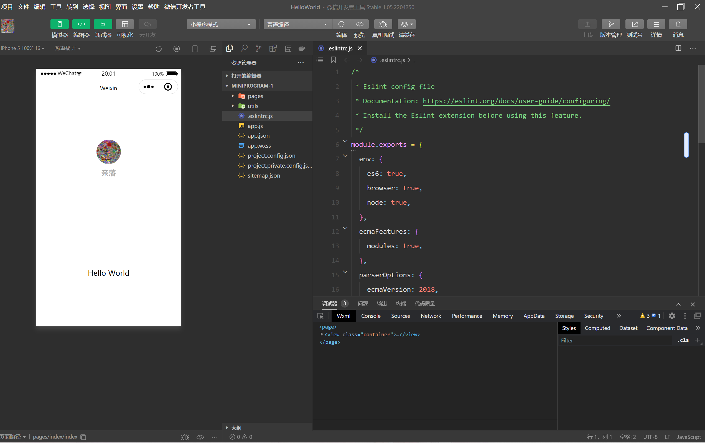
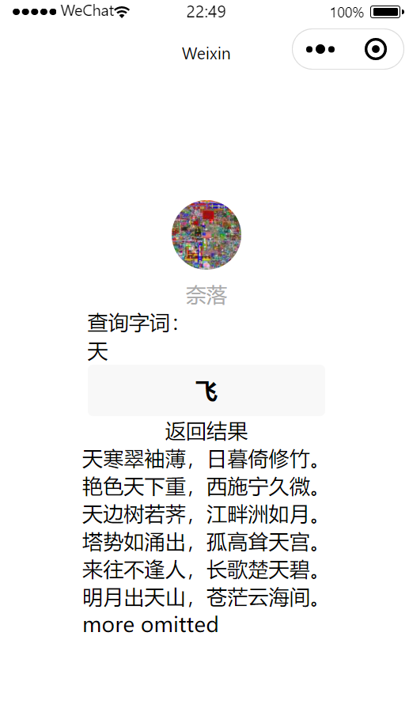
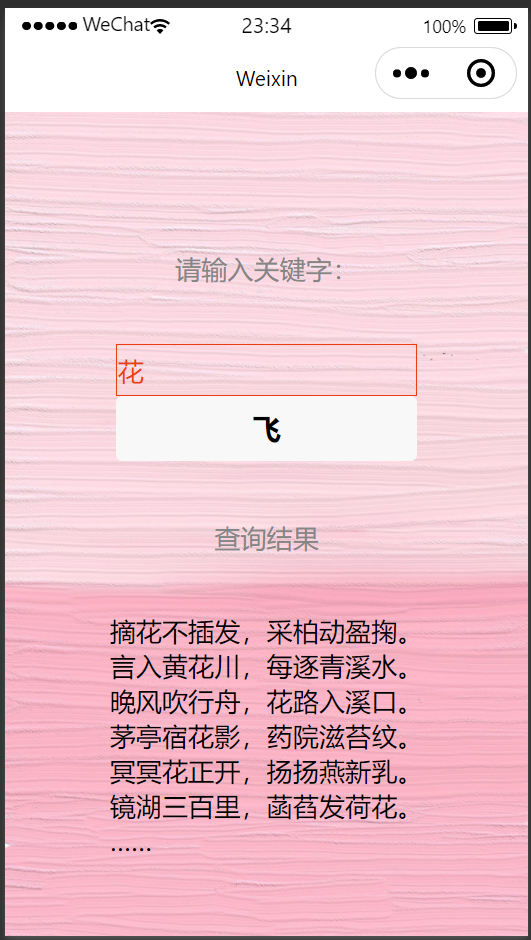

# 微信小程序版：飞花令

## 目的：

将之前写的飞花令APP移植到微信小程序上，初步熟悉一下微信小程序的开发环境。

## 微信平台介绍：

QQ是互联网早期年轻用户居多的时候流行的IM软件，那个时候年轻人可以没有手机但是必须有QQ。到后来随着互联网的发展，互联网用户发展吸引了没有PC而有智能手机的用户，而微信就是跟上了智能手机这个新潮流。

微信小程序是微信平台上的开发环境。微信小程序易于开发、功能灵活、方便部署，还绑定了交友、支付等种功能，所以很有学习的必要。

## 开发步骤和心得：

1. 个人觉得小程序相比于手机APP最大的特点就是轻巧便捷、无需下载打开就能用，同时发布的门槛也比较低，这可能也是小程序相比APP较不稳定的一个原因，经常容易崩溃

2. 进入微信小程序官网下载开发工具；官网上有详细的下载、安装和设置步骤

3. 使用我自己的微信号注册了一个小程序账号

4. 我的桌面屏幕截图

   

5. 我的helloworld手机截屏

   

6. 修改index.wxml中的内容，为界面添加文字显示框和按钮

   ```xml
   <form bindsubmit="go2s">
       查询字词：
       <input name="keystr" value="{{keystr}}" />
       <button form-type="submit">飞</button>
     </form>
     返回结果
     <text>{{res}}</text>
   
   ```

7. 在index.js中添加相关变量和查询函数

   ```javascript
   shi3: "诗三百全文",
   keystr: "花",
   res: "四月南风大麦黄"
   
   go2s: function(e){
       this.data.keystr=e.detail.value.keystr
       this.data.res=""
       if(this.data.shi3.length<20){
         var that=this
         wx.request({
           url: 'http://202.194.14.33:33380/files/shi300.txt',
           success(res){
             that.data.shi3=res.data
           }
         })
       }
       var reg = new RegExp(".*"+this.data.keystr+".*")
       var lines=this.data.shi3.split("\n")
       var cti=0
       for(var i1 in lines){
         if(reg.test(lines[i1])){
           this.data.res += lines[i1]+"\n"
           console.log(lines[i1])
           if(++cti > 5){
             this.data.res += "more omitted\n"
             break;
           }
         }
       }
       this.setData({
         res: this.data.res
       })
     },
   
   ```

8. 点击云开发将诗词库上传到云空间

   

   

9. 更改词库url后得到的效果

   

10. 简单美化了一下界面

    

    