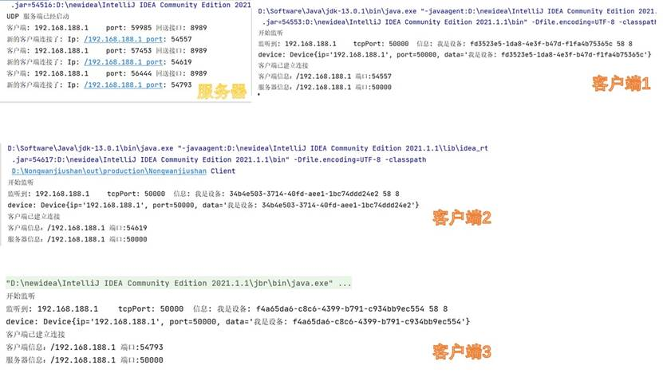
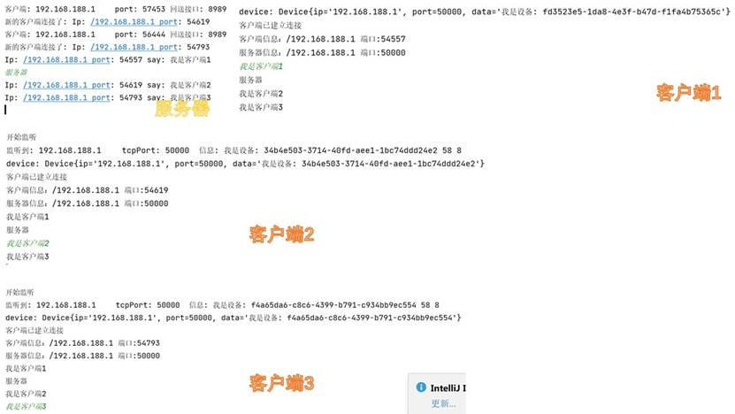
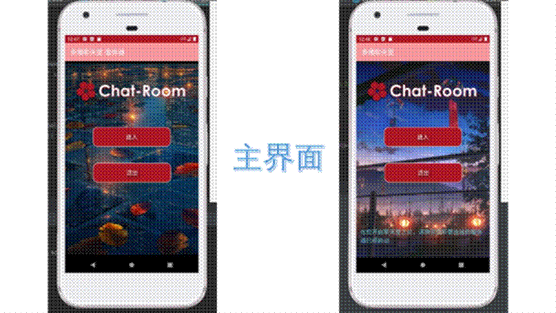
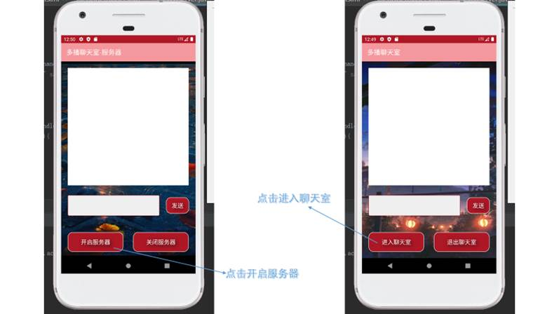
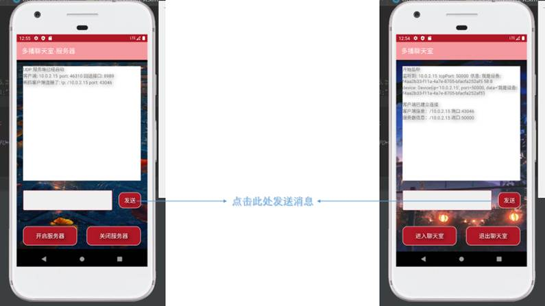
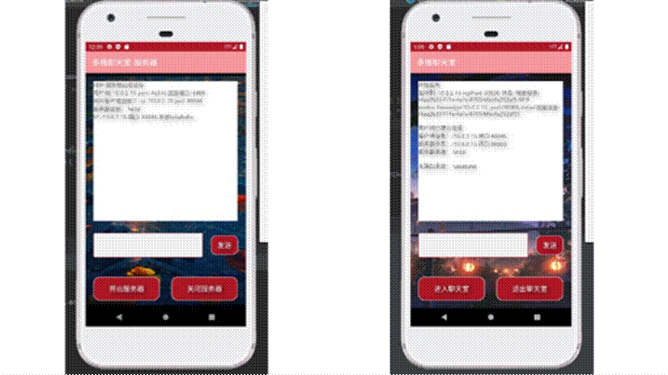
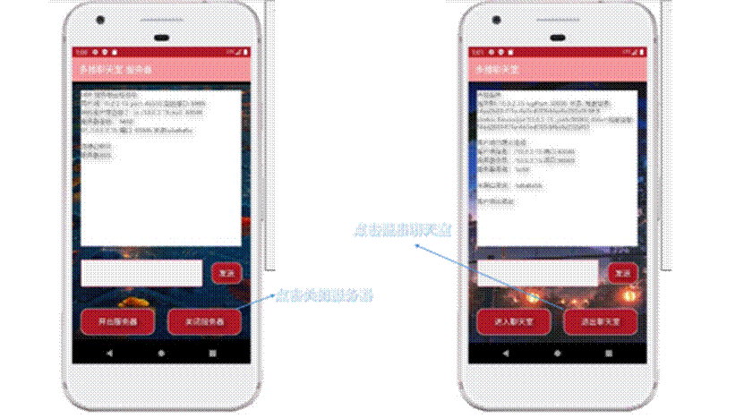

# 多播聊天室

## 目的：

利用Android的socket多播实现一个多人聊天室。客户端通过 udp 广播搜索设备，如果此时有一个服务端对广播的协议有响应，则发送自己的IP和端口给客户端，客户端收到之后，就可以与服务器进行信息交换，而服务器充当一个中转站的作用，负责收发一个客户端的信息，再发送给其他客户端

## 实现步骤：

1. 实现广播

   client 发送一个 255.255.255.255 的受限广播，服务器接收到之后，发送回应给客户端，客户端对于收到的信息进行处理，得到响应设备的相关信息，然后根据信息进行搜索，找到对应的服务器并与之通信

   以下是客户端发送个发送广播的代码，位于chat_room项目下的UdpSearch类

   ```java
   /*
    * 发送广播搜索UDP其他设备，被返回想要的ip
    */
   public class UdpSearch {
       static DeviceInfo start(int timeout){
           try {
               //等待线程
               CountDownLatch searcheLatch = new CountDownLatch(1);
               ResposeListener listener = new ResposeListener(searcheLatch);
               listener.start();
               sendBroadcast();
               //只等待timeout s
               searcheLatch.await(timeout, TimeUnit.SECONDS);
               return listener.getDevices().get(0);
           } catch (Exception e) {
               System.out.println(e.toString());
               e.printStackTrace();
           }
           return null;
       }
   ```

   然后是服务器接收广播的代码，位于chat_room_server项目下的UdpProvider类

   ```java
               Constans.setINFO("UDP 服务端已经启动\n");
               try {
                   //1.获取 datagramSocket 实例,并监听某个端口
                   socket = new DatagramSocket(Constans.PORT);
                   while (!isFinish) {
                       //2.创建一个 udp_broad 的数据包
                       byte[] bytes = new byte[512];
                       DatagramPacket packet = new DatagramPacket(bytes, bytes.length);
                       //3.开始阻塞获取udp数据包
                       socket.receive(packet);
                       //拿到发送端的一些信息
                       String ip = packet.getAddress().getHostAddress();
                       int port = packet.getPort();
                       int length = packet.getLength();
                       ByteBuffer byteBuffer = ByteBuffer.wrap(bytes,0,length);
                       int cmd = byteBuffer.getInt();
                       int responsePort = byteBuffer.getInt();
   //                    System.out.println("客户端: " + ip + "\tport: " + port +"\t回送接口: "+responsePort);
                       Constans.setINFO("客户端: " + ip + "\tport: " + port +"\t回送接口: "+responsePort+"\n");
   ```

   然后在服务端中，解析相应数据；当 cmd 是 CMD_BROAD 才回送数据，同时把 tcp 的端口也回送回去

   ```java
                       /**
                        * 给客户端发送消息  cmd 必须匹配
                        */
                       if (Constans.CMD_BROAD == cmd) {
                           ByteBuffer buffer = ByteBuffer.allocate(256);
                           buffer.putInt(Constans.CMD_BRO_RESPONSE);
                           buffer.putInt(Constans.TCP_PORT);
                           buffer.put(("我是设备: "+ UUID.randomUUID().toString()).getBytes());
                           DatagramPacket receivePacket = new DatagramPacket(buffer.array(),
                                   buffer.position(),
                                   packet.getAddress(), //目标地址
                                   responsePort);      //广播端口
   
                           socket.send(receivePacket);
                       }
                   }
   ```

   然后回到客户端进行接收

   ```java
               try {
                   socket = new DatagramSocket(Constans.BROADCAST_PORT);
                   Constans.setINFO("开始监听\n");
                   while(!isFinish) {
                       //监听回送端口
                       byte[] bytes = new byte[512];
                       DatagramPacket packet = new DatagramPacket(bytes, bytes.length);
                       //拿数据
                       socket.receive(packet);
                       //拿到发送端的一些信息
                       String ip = packet.getAddress().getHostAddress();
                       int port = packet.getPort();
                       int length = packet.getLength();
                       ByteBuffer buffer = ByteBuffer.wrap(bytes,0,length);
                       int cmd = buffer.getInt();
                       if (Constans.CMD_BRO_RESPONSE == cmd) {
                           int tcpPort = buffer.getInt();
                           int pos = buffer.position();
                           String msg = new String(bytes,pos,length - pos);
                           Constans.setINFO("监听到: " + ip + "\ttcpPort: " + tcpPort + "\t信息: " + msg+" "+length+" "+pos+"\n");
                           if (msg.length() > 0) {
                               DeviceInfo device = new DeviceInfo(ip, tcpPort, msg);
                               devices.add(device);
                           }
                           //成功收取到一份
                           searchLatch.countDown();
                       }
   
   ```

2. 实现组播

   当进行一轮广播之后，客户端就可以与服务器进行通讯了，代码位于chat_room项目下的TcpClient类

   ```java
           try {
              PrintStream ps = new PrintStream(socket.getOutputStream());
               boolean isFinish = false;
               do {
                   String msg = Constans.selfINFO+" 发送"+ Constans.sayTEXT;
                   if(MainMenu.readIt){
                       ps.println(msg);
                       MainMenu.readIt=false;
                   }
                   if (MainMenu.conti){
                       isFinish = true;
                   }
                   MainMenu.upDateView();
               }while (!isFinish);
   //            osReader.close();
               ps.close();
   
           } catch (IOException e) {
               e.printStackTrace();
           }
       }
   ```

   在服务器这边，当接收到消息时，就用接口传递出来给每一个客户端，代码位于chat_room_server下的TcpServer类

   ```java
           mExecutorService.execute(new Runnable() {
               @Override
               public void run() {
                   for (ClientDataHandle clientHandle : mClientHandles) {
                       if (clientHandle == handle){
                           //跳过自己
                           continue;
                       }
                       //发送给其他客户端
                       clientHandle.sendMsg(msg);
                   }
               }
           });
   ```

3. 对于消息显示的处理

   创建了一个全局变量String INFO，每当收到消息时，将消息拼接到INFO中，然后用得到的INFO更新TextView的内容

## 测试结果：

1. PC程序测试

   网络通信部分的程序，我是先编写了适应PC端的程序，然后移植到Android中的，一下是对这部分程序的调试结果

   

   

2. Android程序测试

   然后移植到安卓中制作了两个APP，分别是chat_room——客户端，chat_room_server——服务端，以下是两个程序的演示界面

   

   

   

   

   

## 开发过程中遇到的问题：

1. 控件美化

   新建一个名为button_drawable的xml文件用于按钮样式的设置，然后在界面的xml文件中使用android:background="@drawable/button_drawable"进行引用。

   <gradient android:startColor="#AE1725" android:endColor="#AE1725"

   android:angle="180" />可以为按钮设置渐变效果，属性startColor和endColor设置成不同的颜色即可进行混色。

   利用item中的android:state_pressed属性可以为按钮设置按下前和按下后的样式，其中state_pressed="false"为按下前，state_pressed="true"为按下后；按钮上文字的设置与以上属性相同，只不过要另建一个xml专门用来设置文字变化

   为按钮添加阴影的属性如下：

   ```java
   android:shadowColor="#000000"
   android:shadowDx="10"
   android:shadowDy="10"
   android:shadowRadius="30"
   
   ```

   也可以应用到其他控件上。

2. 安卓网络权限的设置

   当把运行在PC上的代码移植到安卓上时，必须在AndroidManifest.xml文件中添加以下语句设置权限

   ```java
   <uses-permission android:name="android.permission.ACCESS_NETWORK_STATE" />
   <uses-permission android:name="android.permission.CHANGE_WIFI_STATE" />
   <uses-permission android:name="android.permission.ACCESS_WIFI_STATE" />
   <uses-permission android:name="android.permission.CHANGE_WIFI_MULTICAST_STATE" />
   <uses-permission android:name="android.permission.INTERNET" />
   <uses-permission android:name="android.permission.ACCESS_FINE_LOCATION"/>
   
   ```

   

3. 实现界面切换

   使用以下三条语句，可以实现界面的切换（从MainActivity切换到MainMenu）：

   ```java
   Intent intent=new Intent(MainActivity.this,MainMenu.class);
   finish();
   startActivity(intent);
   
   ```

   原理是对的，但是真正运行起来APP会闪退，解决方案是在AndroidManifest.xml文件中手动声明新建的Activity：

   ```java
   <activity android:name=".MainMenu"></activity>
   ```

4. 界面布局

   Android中常用的布局方式有三种，LinearLayout、RelativeLayout和FrameLayout，如果父布局规定了其子控件按照某一方向进行，那么子控件在该方向上调整自己位置的能力将消失，控件就不能自由地在界面上放置；但是可以使用相对布局的方式，来实现控件相对自由的放置：

   ```java
   android:layout_below="@+id/textView"
   android:layout_marginLeft="85dp"
   android:layout_marginTop="30dp"
   
   ```

   

5. 解决java.net.BindException: bind failed: EADDRINUSE (Address already in use)异常

   在使用UDP通信时，刚开始使用的语句是：

   ```java
   serverSocket = new ServerSocket(Constans.TCP_PORT);
   ```

   第一次连接没有报错，第二次开始报上面这个错误。从网上查到是由于UDP端口调用close 后不及时释放的问题 ，（原因是多次new udpsocket 第一个虽然调用close 但是系统不及时关闭，有延迟 ，在第二次new 的时候就会报端口被占用的错误）

   于是将代码改成下面这几行就可以解决了：

   ```java
   if(serverSocket==null){
       serverSocket = new ServerSocket();
       serverSocket.setReuseAddress(true);
       serverSocket.bind(new InetSocketAddress(Constans.TCP_PORT));
   }
   
   ```

   这样可以对端口进行复用。

6. Android版本4.0以上主线程无法使用socket

   解决的办法是开启一个新的线程用于网络连接。