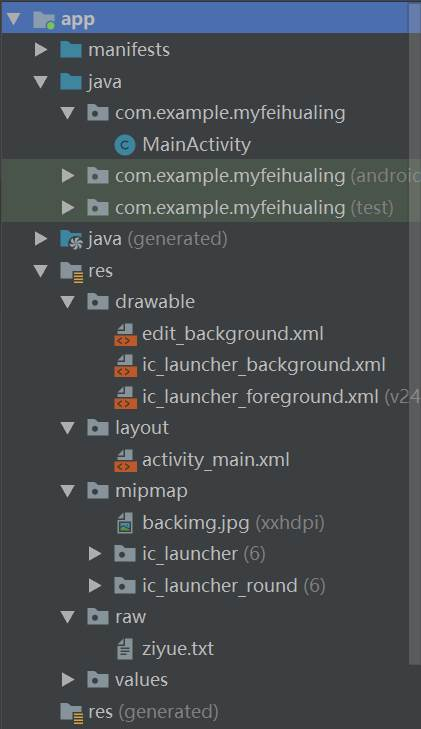

# 飞花令

## **目的：**

从helloworld开始，做一个简单的飞花令，用以检验Android studio是否安装就绪，以及练习最简单的apk开发过程。

## **步骤与内容：**

1. 首先在Android studio中新建了一个项目MyFeiHualing,在activity_main.xml文件中进行界面设计，添加按钮、输入框、显示框等控件，形成基本的应用界面

2. 在xml文件源代码中添加以下等代码

   ```xml
   android:background="@mipmap/backimg"
           
   android:id="@+id/id_key"
   android:layout_width="0dp"
   android:layout_height="0dp"
   android:layout_marginEnd="40dp"
   android:layout_marginRight="40dp"
   
   ```

3. 设置页面及控件的属性，对界面进行美化，同时在drawable  文件夹下新建edit_background.xml文件，对输入框进行进一步的设置，然后在activity_main.xml内用以下代码引入

   ```xml
   android:background="@drawable/edit_background"
   ```

4. 为开始按钮和退出按钮添加槽函数

5. 在MainActivity中定义搜索文本的函数onClick_clear和清空输入框的函数onClick_go，其中onClick_clear的定义如下：

   ```java
       public void onClick_clear(View view){
           EditText key1 = findViewById(R.id.id_key);
           key1.setText("");
       }
   ```

   onClick_go的实现主要分为两个部分：一个部分是根据用户输入的关键字在论语库中进行检索，找到所有满足条件的论语句：

   ```java
               int k = 0;
               String temp = "";
               String result = "";
               Scanner scan = new Scanner(input);
               int max=100;
               while (scan.hasNext()) {
                   String str = scan.nextLine();
                   if (str.contains("【出处】")) {
                       temp = str;
                       continue;
                   }
                   if (str.contains("·")&&str.contains(key.getText().toString())) {
                       k++;
                       result += k + str + "\n" + temp + "\n";
                       max--;
                       if (max<=0) break;
                   }
               }
   ```

6. 存储论语的文件为ziyue.text，其文段格式如下：

   *【译文】国君要像国君的样子，臣子要像臣子的样子，父亲要像父亲的样子，儿子要像儿子的样子。*
   *【出处】《史记·孔子世家》*
   *·君子固穷，小人穷斯漤矣。*

   另一部分是将检索到的结果进行格式化，使关键字显示为不一样的颜色，这里用到了SpannableStringBuilder对象，对得到的结果逐句扫描，把句中的关键字设置为红色，同时设置显示滚动条

   ```java
               SpannableStringBuilder style=new SpannableStringBuilder(result);
               while( k >= 0)
               {
                   int l=result.indexOf(key.getText().toString(), k);
                   int r = l + key.getText().toString().length();
                   if (l == -1)
                       break;
                   k = l + 1;
                   style.setSpan(new ForegroundColorSpan(Color.RED),l,r,Spannable.SPAN_EXCLUSIVE_INCLUSIVE);
               }
               Toast.makeText(MainActivity.this, "一共有" + k + "句！", Toast.LENGTH_SHORT).show();
               res.setMovementMethod(ScrollingMovementMethod.getInstance());
               res.setHorizontallyScrolling(true);
               res.setText(style);
               scan.close();
   ```

   ## 运行截图：

   

   ## 源代码目录结构：
   
   

