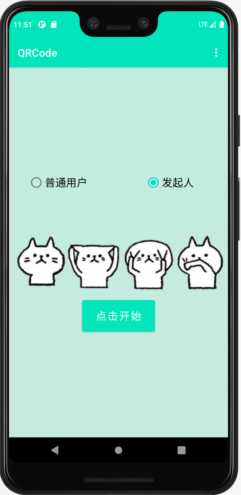
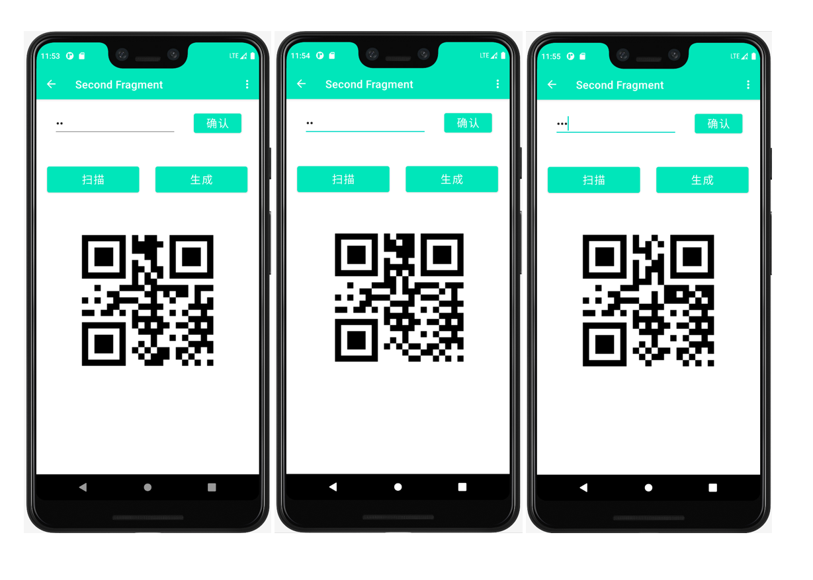
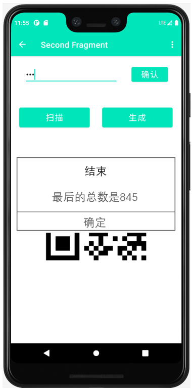

# 二维码接力计算

## 要求：

1. 问题

   N个人围成一圈(网上)，如何计算平均数？

   需求场景如下：

   计算平均数（或和），比如给领导打分、计算平均工资等，要保密每个单独的数不能泄露。

   安全地泄露一个秘密，比如阿桑奇征集秘密，比如给领导提建议，或者依法检举。

   不相信任何第三方，如秘书或服务生或服务器。因为服务生可能是中间某人的外甥，而机器可能有病毒。

2. 算法和协议

   | 步骤说明                                                     |
   | :----------------------------------------------------------- |
   | N个人。每个人持有两个数，评分数A、临时产生的随机数B；要计算所有A的和，B是混淆用途。 |
   | 第一个人当秘书。                                             |
   | 第一圈，从秘书开始，把自己的A和B相加，把和传递个下一个人；下一个人继续加上自己的A和B，继续传下去，最后和回到秘书。 |
   | 第二圈，从秘书开始，把和减去B，把差传给下一个；下一个人继续减去自己的B，继续传下去，最后差回到秘书。 |
   | 最后的差是所有A的和。                                        |
   | 除非某个人的上家和下家串通，否则无法知道这个人的数A。        |

   

## 设计思路：

分为发起人和普通用户两种角色，发起人要作为每一圈的第一个人和最后一个人，每次通过扫描二维码得到上一个人的S，在整个流程结束之前每个人的B都保存在自己的程序中，以便于第二轮减掉，第二轮扫码由第一轮的参与者每个人扫码一次。最终结果显示到发起人的程序上。

## 代码实现：

1. 实现基本功能的逻辑

   Constants类专门用来存储程序所用到的全局变量

   ```java
   public class Constants {
       public static int rounds=1;//进行的轮次，1或2
       public static int id=0;//0普通用户，1发起人
       public static int S=0;
       public static int A=0;
       public static int B=0;
   }
   
   ```

   rounds表示进行的轮次，默认为1，当用户进行第一轮扫码时将其置为2；

   Id由用户启动应用时选择，用来规范不同的操作；

   A是当前用户输入的数，B是程序产生的随机数，S通过扫描二维码得到的上一个用户计算的结果（发起人的S为0）。

2. 二维码扫描功能

   使用了ZXing，一个支持在图像中解码和生成条形码的库。在使用这个库之前需要进行配置。在app下的build.gradle文件中添加在线依赖:

   ```java
   // QRCode 生成
   implementation 'com.google.zxing:core:3.3.0'
   implementation 'com.journeyapps:zxing-android-embedded:3.5.0'
   implementation group: 'com.google.code.gson', name: 'gson', version: '2.8.6'
   
   ```

   然后在应用中使用IntentIntegrator对象 进行二维码扫描，这里需要注意的是如果当前的类是AppCompatActivity的子类就使用

   IntentIntegrator intentIntegrator = new IntentIntegrator(MainActivity.this)方法创建新的对象

   如果在Fragment的子类中就调用

   IntentIntegrator intentIntegrator = IntentIntegrator.forSupportFragment(this)方法。

   同时我也使用到了示例程序中提供的show_QR_code()方法来解析二维码得到上一个人的结果。

   ```java
   //打开扫码请求
       public void onScan(){
           binding.scan.setOnClickListener(new View.OnClickListener() {
               @Override
               public void onClick(View view) {
                   Fragment frg = new Fragment(0);
                   // 开始扫描
                   intentIntegrator.initiateScan();
                   Bundle extras = data.getExtras();
                   Bitmap bitmap = (Bitmap) extras.get("data");
                   binding.QRCode.setImageBitmap(bitmap);
                   int temps = 0;
                   //区分是第一轮还是第二轮，如果是第一轮就扫描得到上一个人的S
                   if (Constants.rounds == 1) {
                       //如果当前用户是普通用户就将扫码解析得到的上一个人的结果加入到当前用户的S中
                       if (Constants.id == 0)
                           temps = show_QR_code();
                       // 随机产生数B
                       Constants.B = (int) (Math.random() * (10000 - 100) + 10);
                       Constants.S = Constants.A + Constants.B + temps;
                   }
   //                如果是第二轮就用上一个人的S减掉当前用户的B
                   else{
                       temps = show_QR_code();
                       Constants.S = temps - Constants.B;
                       //如果当前用户是发起人就直接显示结果
                       if (Constants.id == 1){
                           new  AlertDialog.Builder(a)
                                   .setTitle("结束" )
                                   .setMessage("最后的总数是"+Constants.S)
                                   .setPositiveButton("确定" ,  null )
                                   .show();
                       }
   
                   }
                   Constants.rounds=2;
               }
           });
       }
   
   ```

   

3. 二维码创建功能

   使用了示例程序的create_QR_code()方法

   ```java
   //创建二维码
       public void onCreate(){
           binding.create.setOnClickListener(new View.OnClickListener() {
               @Override
               public void onClick(View view) {
                   create_QR_code();
               }
           });
       }
   
   ```

   

## 程序测试

用户在开始界面选择自己的身份(如下)



参与人数3：分别输入56，12，777，会生成三种不同的二维码（如下）

然后每个人都选择传递模式，轮流扫码



当发起人第二次扫码的时候，其扫码结果将会显示（如图三）

每个人都会扫上家的码两次，都会两次展示二维码给下一个人

