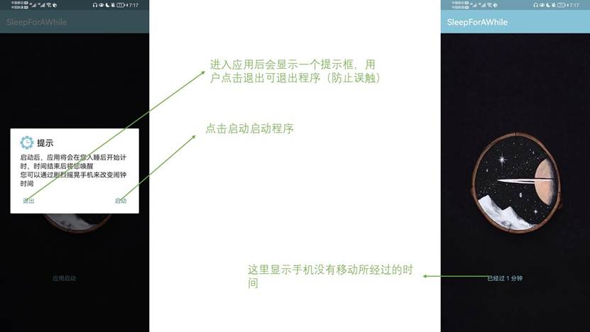
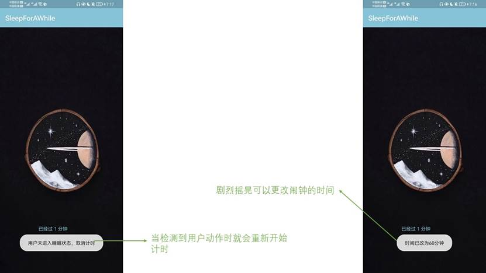

# “小睡一会儿”APP

## 目标：

实现一个闹铃，在用户睡着后一段时间启动（用户自己设置）。

通过运动传感器检测是否睡着。

## 实现过程：

全局变量timeDelay用于设置闹钟的时间，默认为30分钟，用户剧烈摇晃手机可更改为60分钟；

m用于记录用户未移动手机的时间，当用户移动时，m重新设置为0;

mu用于在到规定时间时播放闹铃；

```java
    private static int timeDelay=30;
    private static int m=0;
    private static MediaPlayer mu;
```

实现提示框的代码，“退出”按钮绑定的事件是关闭应用，“启动”按钮绑定的事件是startIT()方法，用于启动主程序

```java
        AlertDialog alertdialog = new AlertDialog.Builder(this).setTitle("提示")
        .setIcon(ContextCompat.getDrawable(this,R.mipmap.mainicon))
        .setMessage("启动后，应用将会在您入睡后开始计时，时间结束后将您唤醒\n您可以通过剧烈摇晃手机来改变闹钟时间")
        .setPositiveButton("启动", new DialogInterface.OnClickListener(){
            @Override
            public void onClick(DialogInterface dialog, int which) {
                startIT();
            }
        })
        .setNeutralButton("退出",new DialogInterface.OnClickListener(){
            @Override
            public void onClick(DialogInterface dialog, int which) {
                android.os.Process.killProcess(android.os.Process.myPid()); //获取PID
                System.exit(0);   //常规java、c#的标准退出法，返回值为0代表正常退出
            }
        })
        .create();
        alertdialog.show();
```

startIT()方法内关于改变闹钟时间的逻辑：在老师给出的实现方法的基础上又加入了一重判断，如果用户剧烈摇晃手机即满足Math.abs(x)>25||Math.abs(y)>25||Math.abs(z)>25的条件，则可以将timeDelay更改为60分钟

```java
if ((Math.abs(x)>12||Math.abs(y)>12||Math.abs(z)>12))
{
	time0 = System.currentTimeMillis()/1000;////获得系统的时间，单位为毫秒,转换为秒
	// String tips=tt+" 动:"+x+"/"+y+"/"+z +" @ "+time0;
	tips = "用户未进入睡眠状态，取消计时";
	m=0;
	Toast.makeText(MainActivity.this, tips, Toast.LENGTH_SHORT).show();
	Log.v("xyz", tips);
	if((Math.abs(x)>25||Math.abs(y)>25||Math.abs(z)>25)){
		timeDelay=60;
		Toast.makeText(MainActivity.this, "时间已改为60分钟", Toast.LENGTH_SHORT).show();
	}
}
```

学习到了Timer中schedule（）方法的用法：第一个参数是 TimerTask 类，在包：import java.util.TimerTask 中，使用者要继承该类，并实现 public void run() 方法，因为 TimerTask 类实现了 Runnable 接口；

第二个参数的作用是用户调用 schedule() 方法后，要等待这么长的时间才可以第一次执行 run() 方法；

第三个参数是第一次调用之后，从第二次开始每隔多长的时间调用一次 run() 方法；

于是对所给的方法进行了如下修改，每经过一分钟就在界面上显示经过的时间，当m等于timeDelay，就播放闹铃

```java
        class Every1m extends TimerTask {
//            int m=0;
            @Override
            public void run() {
                m++;
                flush.sendEmptyMessage(m);

                if(m==timeDelay){

                    //mMediaPlayer.setAudioStreamType(AudioManager.STREAM_MUSIC);
                    mu.setLooping(true);
                    mu.start();
                }

            }
        }
        Timer timer1m = new Timer();
        timer1m.schedule(new Every1m(), 3*1000, 1*60*1000);//执行循环任务，三个参数分别为任务内容，执行开始时间，多长时间执行一次，在子线程中执行

```

最后学会了如何在自己的手机上调试程序，参考了以下博文：

[]: https://www.jb51.net/shouji/628406.html
[]: https://blog.csdn.net/qq_40610760/article/details/88131495?spm=1001.2101.3001.6650.1&amp;utm_medium=distribute.pc_relevant.none-task-blog-2%7Edefault%7ECTRLIST%7ERate-1.pc_relevant_default&amp;depth_1-utm_source=distribute.pc_relevant.none-task-blog-2%7Edefault%7ECTRLIST%7ERate-1.pc_relevant_default&amp;utm_relevant_index=1

## 运行截图：



