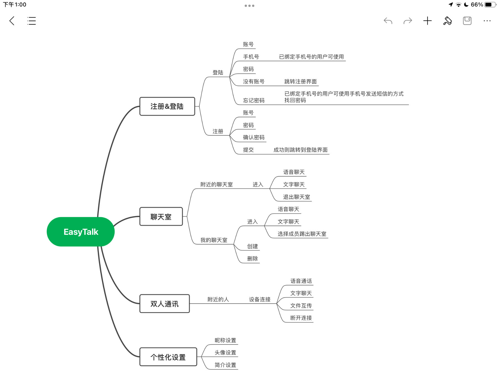
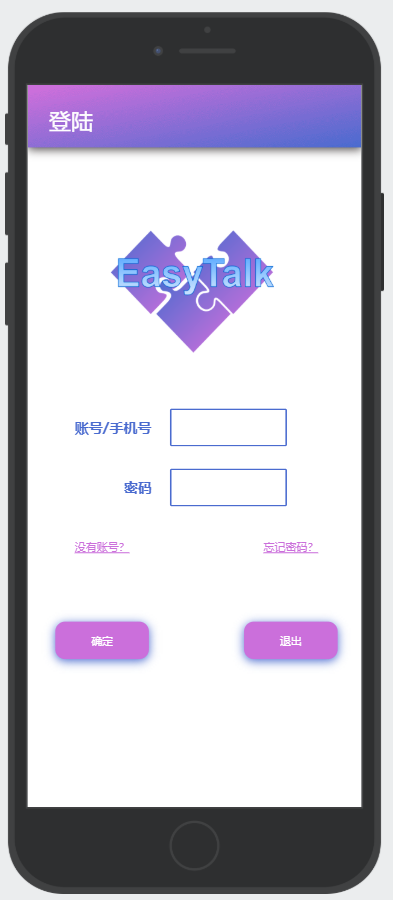
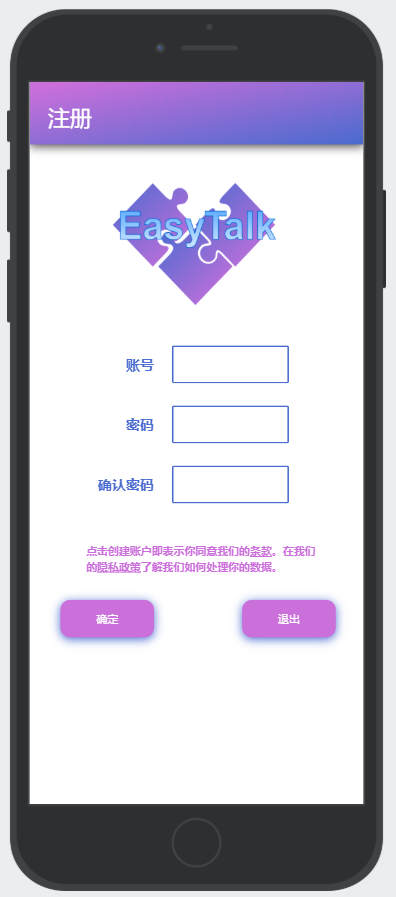
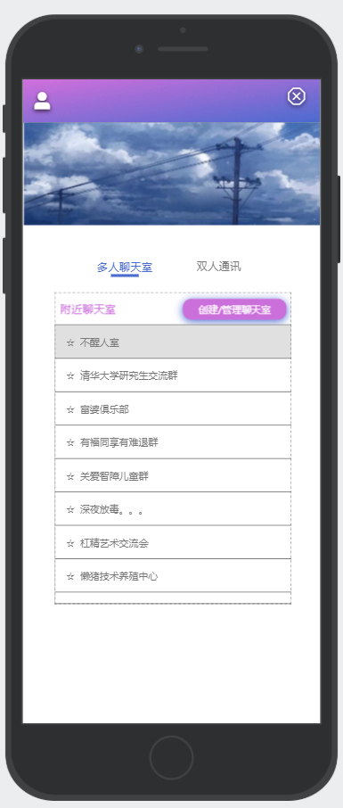
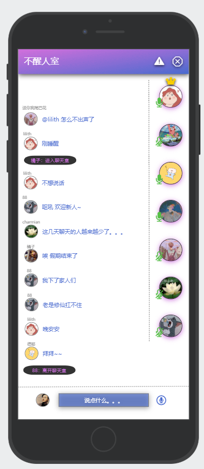
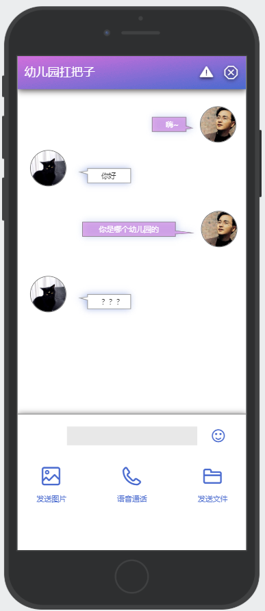

# WIFI_DIRECT_TALK 设计

## 产品目标

1. 产品目标

   EsayTalk是一款WiFi对讲机安卓APP，在使用本产品时，用户无需连接网络或者蓝牙，即可与一定距离内的其他用户进行语音通话、文件传输和文字交流；本产品适用于短距离通话、文件互传、区域聊天室、交友等多种情景，具有操作简单、使用方便的特点

2. 产品图标

   

3. 功能清单

   | 模块名    | 功能点                                                       | 功能描述                                                     |
   | --------- | ------------------------------------------------------------ | ------------------------------------------------------------ |
   | 注册&登陆 | 账号注册、手机号绑定、账号登录、手机号登陆、修改密码         | 为用户提供账号注册的功能，用户可以选择是否绑定手机号；未绑定手机号的用户可以使用账号密码登陆；已绑定手机号的用户还可以使用手机号登陆和修改密码的功能 |
   | 聊天室    | 检索附近聊天室、加入已存在的聊天室、创建聊天室、多人语音/文字聊天 | 用户可以通过APP检索附近的聊天室，选择一个聊天室加入；也可以自己创建一个聊天室，等待他人的加入；在聊天室中可以进行多人语音和文字聊天 |
   | 双人通讯  | 搜索附近设备、设备连接、语音通话、文字聊天、文件互传         | 用户可以检索附近的设备，请求与其建立连接待对方同意后即可进入连接状态，此时双方可以进行语音通话、文字聊天和文件互传 |
   | 个性化    | 昵称设置、头像设置、简介设置                                 | 用户可以对自己的个人信息进行设置，包括昵称、头像和个人简介   |

   

4. 产品架构图

   

## 全局说明

1. 功能权限

   登录状态下：所有功能都可使用。

   未登录状态下：只能看到产品的介绍说明和使用手册，点击开始使用直接跳转登录页面。

2. 常见操作

   **刷新**

   下拉刷新（仅存在于一级页面和列表页面）

   返回刷新（返回放回上一页的时候，刷新页面）

   **删除**

   所有删除操作都弹窗提示用户是否确认删除。

   **Home****键**

   按 home 键，程序切换至后台运行，再次打开则回到按home键时的页面。

   **安全**

   举报（需要联网或者拨打电话）：当用户发现某位用户或者某个聊天室存在违法违规行为，可以选择进行举报并提供相应的证据，一经客服查实，被举报的用户或聊天室将会受到相应的处罚

## 功能说明&界面展示

1. 登录界面

   

   通过输入账号和密码进行登陆，已绑定手机号的用户也可以用手机号代替账号，输入完成、经过验证后即可进入应用主界面；点击没有账号跳转注册界面；点击忘记密码可以通过短信验证码的方式找回密码或修改密码（仅限已经绑定手机号的用户）

2. 注册界面

   

   输入账号、密码、确认密码后点击确定，通过验证后即可创建新的账号，然后跳转登录界面；点击划线部分文字可以查看产品的条款和隐私政策

3. 应用主界面

   

   在应用主界面中可以选择多人聊天室或者双人通讯，点击多人聊天室即可显示附近的多人聊天室，选择一个点击即可进入，也可以通过“创建/管理聊天室”来创建或者查看自己的聊天室；点击双人通讯即可显示附近的设备，选择一个点击即可请求与之连接；点击左上角的人物图标可以进入个性化设置界面；点击右上角的X图标即可退出登陆；页面上方是一个走马灯，可以显示关于产品的介绍，也可以显示赞助商的广告，可以定期更新

4. 多人聊天室界面

   

   整个屏幕被分为四大部分

   **正上方的菜单条**：左上角显示的是聊天室的名字；点击右上角的三角图标可以对当前聊天室的违法违规行为进行举报；点击右上角的图标即可退出该聊天室

   **左侧的聊天记录**：聊天室中的每个人发送的文字都会按照先后顺序动态记录在这里，在文字前会显示发出者的昵称和头像；当有人进入聊天室或者离开聊天室时，系统的提示信息也会显示在这里

   **右侧的头像菜单**：右侧显示了聊天室中所有人的头像，群主的头像被排在第一位，并且带有皇冠标识；每个头像的左下角都有一个话筒，当前正在说话的的人的话筒会显示解除限制

   **正下方的输入区**：左侧是当前用户的头像，中间的输入框可以输入文字并发送；右侧的话筒标识点击可以开始语音聊天

5. 双人通讯界面

   

   整个屏幕被分为三大部分

   **正上方的菜单条**：左侧显示的是连接对象的昵称；点击右上角的三角图标可以对连接用户的违法违规行为进行举报；点击右上角的图标即可断开与该用户的连接

   **中间的通讯区**：这个区域显示的是当前用户与连接用户的文字通讯记录

   **正下方的功能区**：灰色的是文字输入框，用户可以点击这里与连接用户进行文字交流；点击右侧的笑脸图标可以选择应用预设的表情进行发送；下方可以是可以选择的三个功能，分别是发送图片、语音通话和发送文件

## 非功能性需求

1. **性能需求**

   APP启动和操作响应的时间优化。

   页面可点击重新加载。

   页面切换需要流畅，不能有明显卡顿。

   页面加载速度要快。

2. **可用性需求**

   系统支持：Android 6.0以上系统iOS 9.0以上。

   用户可控：页面出口应该明显、退出时需用户手动确认，防止用户误操作。

   界面适配：适配主流设备分辨率。

   一致性：保持所有相同界面设计/操作/弹窗反馈文案显示的一致性

## 技术支持

1. **第三方短信验证码SDK**

   产品通过使用第三方应用集成短信sdk，以实现用户绑定手机号获取短信验证码，以及用户通过手机验证码找回密码的功能

2. **安卓数据库SOLite**

   由于产品要存储用户的个人信息，所以要使用数据库，SQLite是一个轻量级的嵌入式开源数据库，完全可以满足产品存储信息的要求，通过相关的android 的java类间接对数据库进行增删改查等操作，以实现产品相关功能

3. **Android Wifi Direct**

   Wi-Fi Direc的API允许应用程序不通过网络或热点，直接与周围的设备进行连接。应用程序可以迅速地查找附近的设备，交换信息。并且与蓝牙相比，Wi-Fi Direct的通讯范围更大。利用这个技术就可以实现产品多人聊天室和双人通讯的模块功能，这也是产品所使用的核心技术

## 附录

1. **个人总结**

   通过完成这个基于wifi-direct对讲机APP的设计，我学习到了很多相关的技术，还掌握了安卓APP界面设计应用—摹客的使用，同时也学会了在一款APP的设计中，怎样更全面、更合理地去考虑它的功能和界面。

   对于界面的设计，尤其是聊天室和双人通讯的界面，我参考了一些市面上比较主流或者常见的聊天软件和聊天室软件，如QQ、soul等

   对于Android Wifi Direct技术的学习我参考了网上的几篇博客，了解了其原理、过程和应用；对于安卓数据库SOLite，我参考了菜鸟教程的介绍和教程，了解到SOLite是一个进程内的库，它的使用无需任何系统配置，也不需要服务器非常简单，语法很像SQL。

2. **对于附件EsayTalk演示.mp4的说明**

   EsayTalk这个APP的界面和功能设计，我主要是借助摹客来实现的，EsayTalk演示.mp4是一个EsayTalk功能的简单演示

